# Tutorial: Quartus and ModelSim
by Eddie Hung (with updates by Guy Lemieux, Steve Wilton, and Mieszko Lis)

## Introduction

The purpose of this document is to very briefly describe how to use the Intel Quartus Prime and ModelSim software packages to design digital systems. It is targeted at students of CPEN 311 at the University of British Columbia.

A typical design flow may look like this:

First, the designer will describe their circuit using a Hardware Description Language (HDL) like Verilog. Next, the designer will simulate the Verilog to test the design, fix any bugs, and repeat until the design functions correctly. We will be using the industry-standard ModelSim simulator to perform this logic simulation stage.

The third stage is to compile the circuit, from the text-like Verilog description into a network of logic gates called a _netlist_ (this step is often called _synthesis_). The netlist can be used to program Field-Programmable Gate-Arrays (FPGAs), as we will be doing in this course, or to fabricate a custom ASIC chip.

We will be using another industry-standard tool, Intel Quartus II, to synthesize our 
Verilog into a format compatible with the Intel FPGAs we use in this course. Finally, we will program the FPGA chip with this output to actually realize the circuit in hardware on a development board. Instructions for the DE1-SoC board are included.

## Installing Quartus and ModelSim

You can choose from either Windows or Linux versions of the software. If you have a Mac, you can run will either Windows or Linux inside VirtualBox or a similar virtual machine environment.

You should install [Quartus Prime Lite](http://dl.altera.com/?edition=lite) (it's free). You will want version **17.1.1**, which means that you need to first install 17.1 and then install update 17.1.1.593. Make sure your download includes the ModelSim simulator and support for the Cyclone V FPGA device that is the heart of your DE1-SoC board, and that that you select all of these during installation.

If you have problems installing the software, please contact your TA in the first week of Lab 1.  

## Simulating using ModelSim

In this section, we will look at how to simulate a hardware design using ModelSim.

Find the `adder.sv` and `tb_adder.sv` files from this repository; these files describe a very simple combinational adder and a testbench for it. The circuit inputs are two sets of sliding switches on the board, and that the output is a set of red LEDs. Switches 0 to 3 are used to describe the 4-bit binary value that is added to switches 4 to 7, and the 4-bit binary output will be shown on the red LEDs 0 to 3. The `tb_adder.sv` testbench will virtually stimulate the inputs of the adder design (`adder.sv`, often known as the _design under test_ or _DUT_) in order to fully exercise its behaviour.

First, start up ModelSim and select _File&rarr;New&rarr;Project_. Choose whatever project name and location you like, but leave the other settings as shown below:

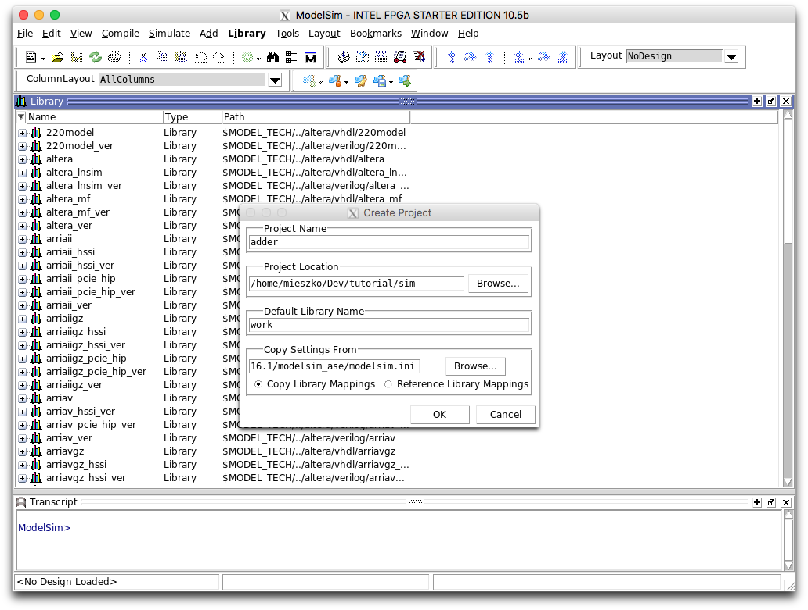

Next, select _Add Existing File_ and select both `.sv` files that you previously checked out as follows:

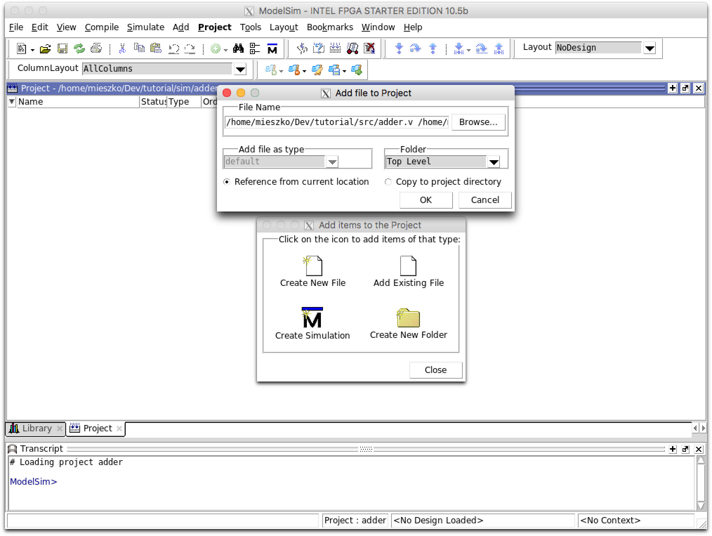

Right-click and select _Compile&rarr;Compile All_ to compile all the source files in your project (the  button does the same thing).

You should now see that one of the source files, `adder.sv` will have 
compiled correctly (as indicated by a green tick in its status column, and a 
green “successful” message in the transcript window at the bottom).
However, `adder_tb.sv` was not so successful:

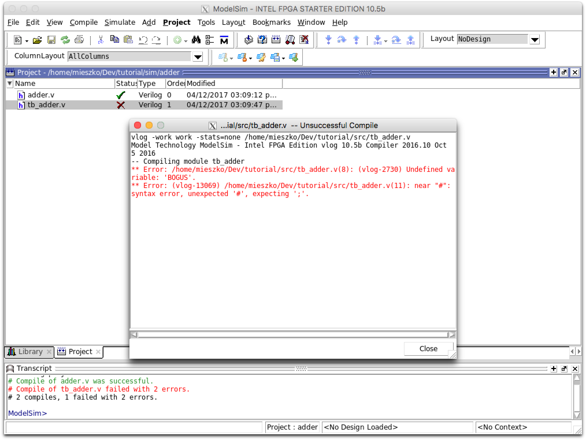

Double-click on the failed message in the transcript, and then double-click 
again on the first error message in the subsequent window. This will open the code up to the right of your Project window and helpfully take you to the vicinity of the error:

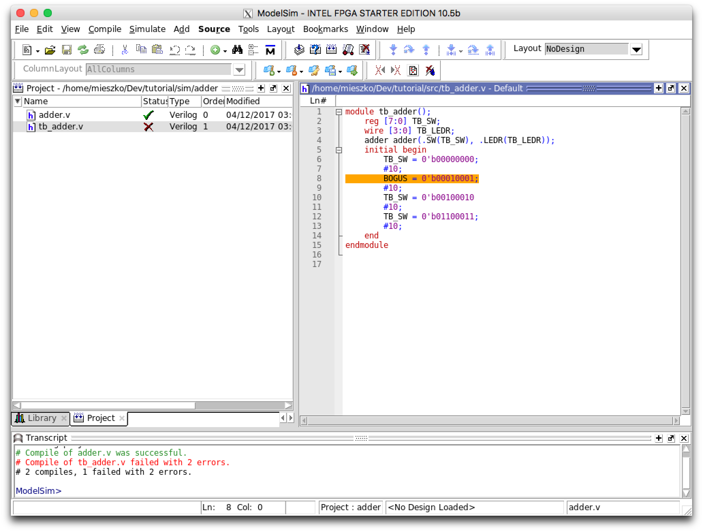

The error message here is complaining about an undefined variable. Fix the error and recompile; both files should now compile successfully.

Now comes the fun part, actually simulating your design. Select the _Library_ tab, open up the `work` library:

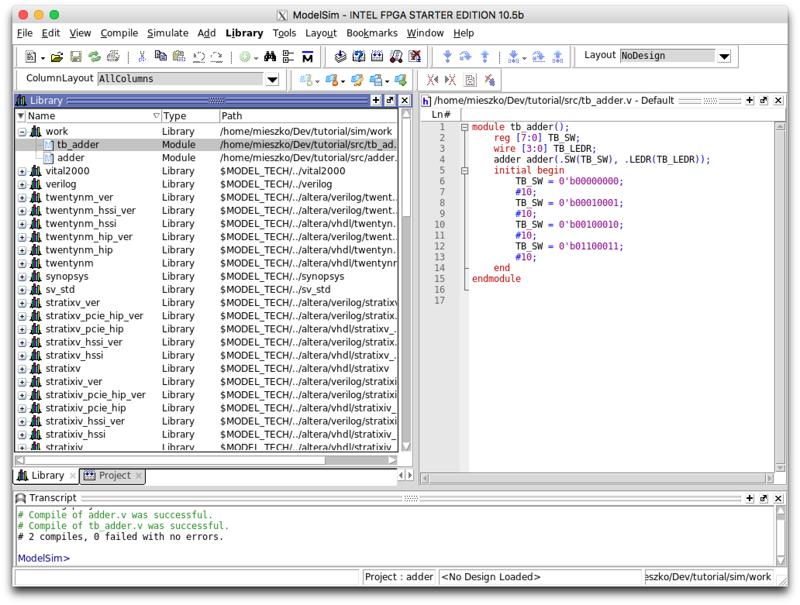

Select the signals that you want to see during simulation from the (dark blue) _Objects_ window by right-clicking inside and choosing _Add Wave_. For now, select all signals by choosing _Add To&rarr;Wave&rarr;Signals in Region_, which should bring you to this state:

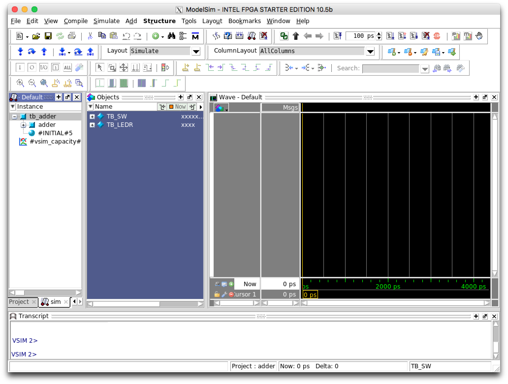

You can delete a signal by right-clicking on the item in the _Wave_ view and choosing _Edit&rarr;Delete_.

Change the _Run Length_ to “40 ns”, and click the _Run_ button to the right. Now select the _Wave_ window by clicking anywhere in the waveform viewer, and then click on the _Zoom Full_ button to view the whole waveform at once:

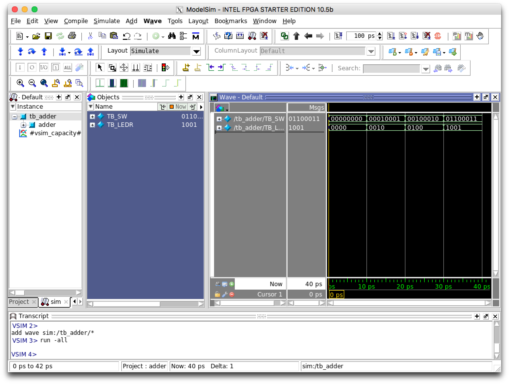

Study the waveforms carefully &mdash; initially, the switch inputs (SW) are all 
zero, and hence `0000` + `0000` gives a zero output on the LEDR wires. Check that the other test cases are also correct. Run the simulation again for another 40 ns, and _Zoom Full_ again. What do you see? 

Another way to run your simulation is by using the command-line interface (CLI). You may have noticed that clicking on the _Run_ button will result in a `run` command issued in the transcript window. Try it for yourself by entering `run 100ns` onto the command line.

A very useful feature in ModelSim is to be able to restart a simulation, whilst keeping the signals selected in the waveform viewer intact. The restart button is located to the left of the _Run Length_ text box &mdash; try it to make sure that it works. In the future, when you come to write your own Verilog, you will find that you can edit your code, re-compile it, and then restart the simulation using this button without having to go through the whole setup procedure that we just went through. In the CLI, this can also be achieved using the `restart` command.

Many, many other commands exist for use in this ModelSim Tcl (“tickle”) interface: almost everything you can do using the graphical interface can be done with the command line, which will even allow you to automate sequences of tasks. In time, you'll come to learn more commands and embrace some as your favourites.

To save your simulated waveforms for a report, select the waveform window by clicking anywhere inside, and then choose _File&rarr;Export&rarr;Image_.

## Synthesis with Quartus Prime

Now that you have fully simulated your design and are (fairly) confident that it works, it is now time to compile it into real hardware to be implemented on our FPGA.

Start up Quartus, and choose _Create a New Project_. Click _Next_ to advance on to the second page, and you should end up here:

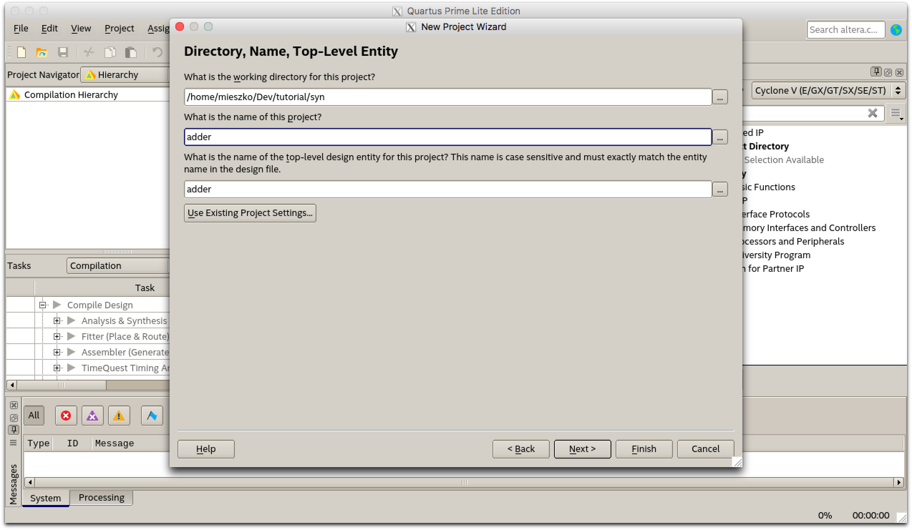

Again, you may choose any working directory, but **it is crucially important that you enter the top-level design entity name as shown**. This top-level design entity represents the topmost entity or module (i.e. the one which contains all other entities) that is to be implemented in hardware, and its name must match the entity name inside its Verilog file. In this document, this entity is **adder**.

In the following menu, add _only_ the `adder.sv` file, which
contains our circuit description. The test-bench is not necessary for hardware implementation because we will be able to physically change the inputs of the actual circuit. Furthermore, the Verilog used in test-benches is _unsynthesizable_. Don't worry if you don't understand what this term means right now, all will become clear in time (but only if you go to the lectures). Make sure you click the _Add_ button after browsing for the file, otherwise it will not be added. You should now see something like this:

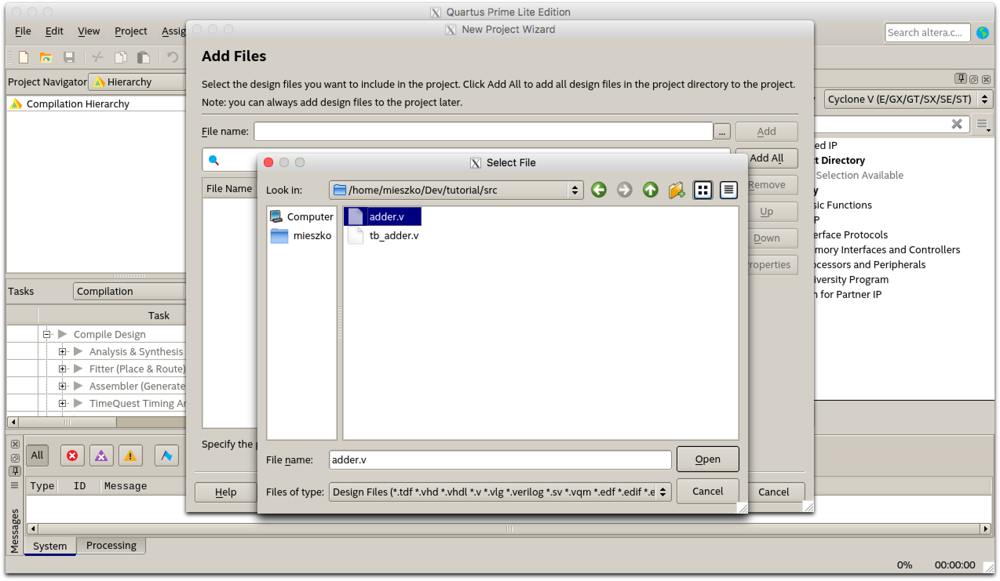

The subsequent menu will ask you to select the FPGA device that the project is
compiling the hardware for. Different FPGAs have different ways of implementing circuit logic, and different numbers of pins so make sure you select the right model. Make sure you choose the Cyclone V SE Mainstream (`5CSEMA5F31C6`) for your DE1-SoC and the Cyclone V E Base (`5CEBA4F23C7`) if you have a DE0-CV.

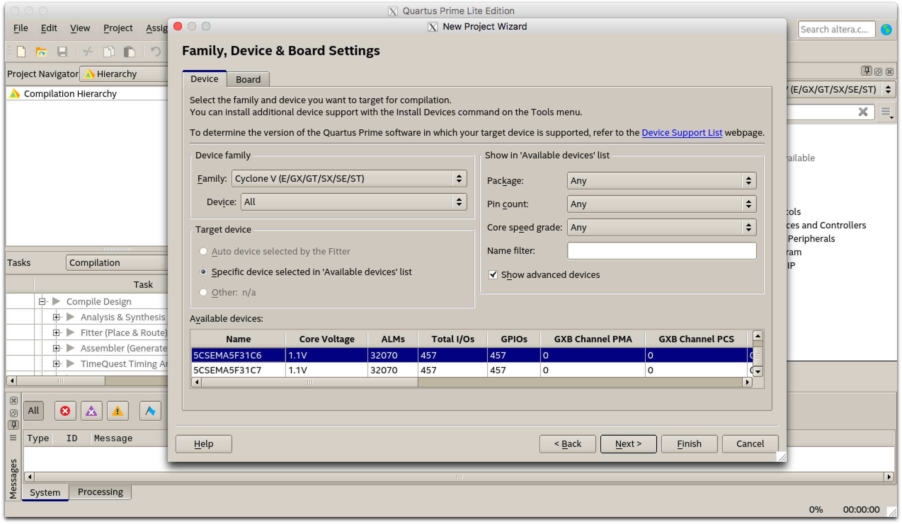

If you're ever stuck for this number during the lab, you can find this model number is printed on the actual FPGA chip itself &mdash; look at the largest chip on your development board.

Next, you'll need to tell Quartus exactly which I/O pins of the FPGA are connected to which signals in the adder. Recall that we have used the _SW_ signal as the input, and _LEDR_ as the output. We need to tell Quartus exactly which pins those signals map to on the PCB.

**This is a critically important step. Forgoing this task, or loading an incorrect assignments file, can DAMAGE YOUR FPGA!**

Find the `DE1_SoC.qsf` pin assignment file (or the equivalent for your board) in this repository. In Quartus, select _Assignments&rarr;Import Assignments_, and select the
downloaded file:

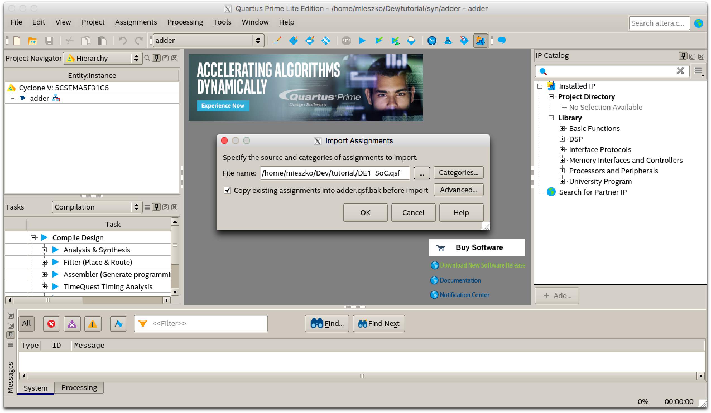

Ensure that an “Import Completed” message is visible in the output window. The number of assignments depends on the development board.

Now you are ready to compile your design, so click on the aptly-named _Start 
Compilation_ button. (Alternatively, this is available under the _Processing_ menu.)
Wait a little while for it to do its thing, after which you should see a 
successful prompt:

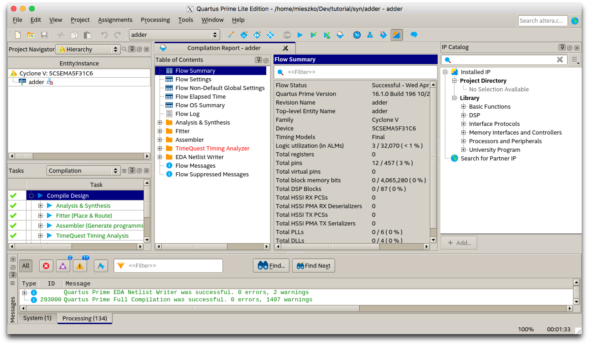

If you don't, check that the Verilog source file was added successfully in _Assignments&rarr;Settings&rarr;Files_.

If your Verilog contains errors, you can double-click on `adder` in the top-left entity window to edit the files and fix them:

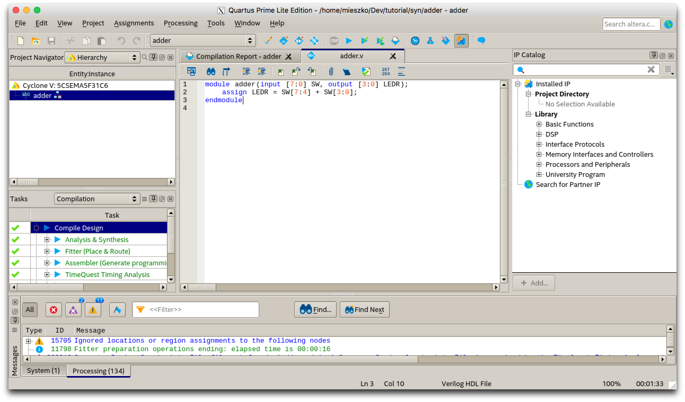

You may notice that even in an successful compilation, a number of info and warnings messages are still generated. Some of those messages are actually quite important, but aren't strictly errors (e.g. any “inferring latches” messages almost always indicate that you are writing unsynthesizable Verilog). Over time and with experience you will come 
to learn which ones to look out for and what they mean.

Here's a handy checklist for Quartus-related problems:

- Are you using the correct version of Quartus~II?
- Is your disk full? (If it is, Quartus~II will not be able to create any new files and will crash. Delete a few things off it and try again. (**Hint:** the `db` and `incremental_db` folders in old projects take up considerable space and can be safely deleted.)
- Is your top-level entity set correctly? (You can change this in _Assignments&rarr;Settings&rarr;General_.)
- Have you set the correct FPGA device model? (You can change this from Assignments&rarr;Device)
- Have you added all source files into your project? (Check in Assignments&rarr;Settings&rarr;Files)
- Have you correctly imported your pin assignments? (You can import them again, and compile again, if you are not sure.)

## Programming the FPGA using Quartus Prime

The last step of this tutorial is to program the FPGA chip on the development board.
The output of Quartus from the previous section is a file known as a _bitstream_.
This bitstream describes the digital logic used to implement the described circuit in a format specific to the selected FPGA model.

First, attach the power cable to the power connector of your development board, and the USB cable to the _USB BLASTER_ port.

For the DE0-CV, ensure that the programming switch (below the red power switch, and left of the LCD screen) is set to the _RUN_ mode. This enables the FPGA to be temporarily programmed, which is sufficient for this course, as opposed to storing the bitstream permanently into the flash memory. Also, while the DE0-CV can be powered from the USB cable, we suggest using the power adapter.

If you are using your own computer, you should see that it will prompt you to install a driver for the new USB device that you have just attached. Tell it to search for the driver in a folder inside the Quartus Prime install directory.

_NOTE: You are more than welcome to use your own computer to program the
DE1 boards during the lab sessions, but please bring your own USB cable.
The USB cables that are available in the labs are attached to the computers and
should not be removed._

To transfer the bitstream onto the FPGA, we will be using the _Programmer_ tool.
Select it inside Quartus from _Tools&rarr;Programmer_, or click on its button from the same toolbar where you found _Start Compilation_, which should bring up a window with the corresponding device chain, like this:

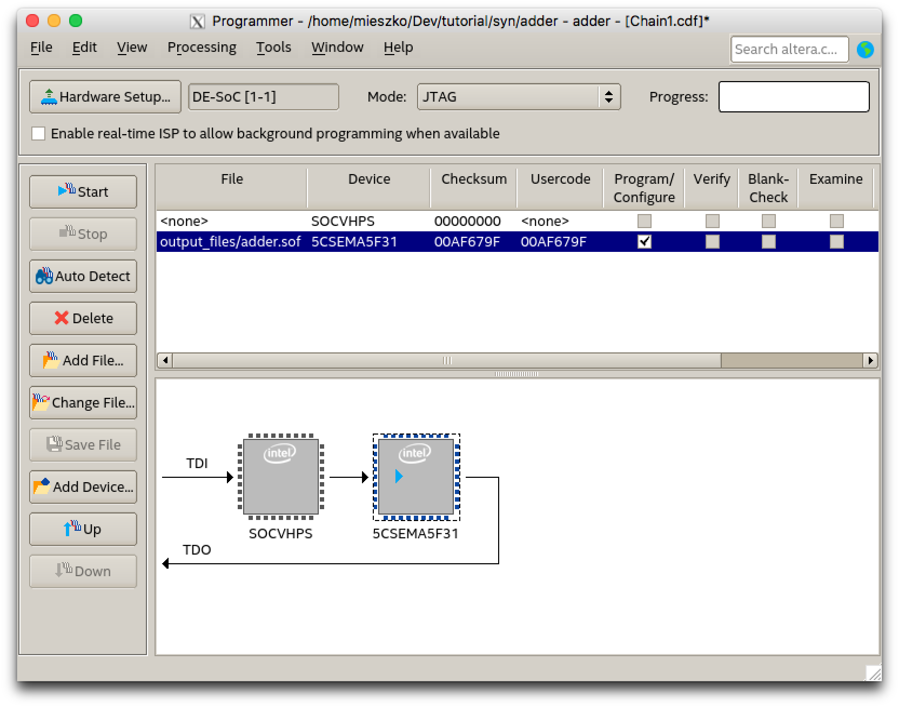

Click on the _Hardware Setup_ button in the top left of the Programmer.
From the _Currently selected hardware_ drop-down box, select your device:

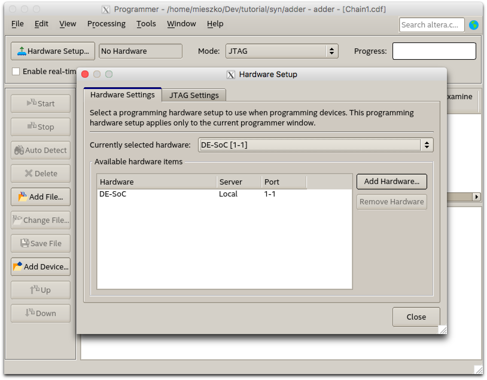

(On some systems the device port is called _USB Blaster_). If you cannot find your device, ensure that the USB cable is plugged in to the BLASTER port on the development board, that the other end is in a working port on your computer, and that the board is powered on.

Now you need to add the bitstream file, `adder.sof`. Use _Auto Detect_ to see the device chain, which will also check that the device is connected correctly. Select your device when prompted with the options below:

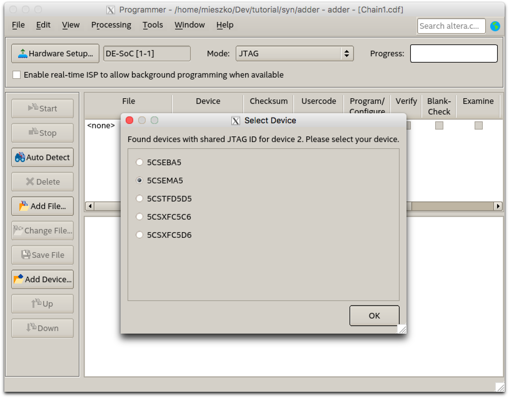

**Make sure you select the device that corresponds to your board!**

For the DE1-SoC, there should be **two** devices in the chain. Use _Right Click&rarr;Edit&rarr;Change File_ on the second device in the chain to add `adder.sof` to that device.

Additionally, the _Mode_ drop-down box should say “JTAG” and the _Program/Configure_ box in front of the FPGA device should be checked. Quartus II will not let you program a bitstream intended for another model; if you have trouble, check that the FPGA model is set correctly.

Finally, click on the _Start_ button in the top left corner of the Programmer. The progress bar should say “100% (Successful)”. Play around with the SW0-7 switches on your DE1-SoC board to ensure that the adder is working correctly.

**Congratulations!**

You have now successfully simulated a Verilog design using ModelSim to ensure that it functions correctly, compiled (or synthesized) this design into a hardware bitstream using Quartus, and programmed this  bitstream onto the FPGA. Give yourself a pat on the back.

In case it's not quite so plain-sailing in the future, here's a handy checklist
for any Programmer-related problems:

- Are you using the correct version of Quartus?
- Is your drive full? (If it is, Quartus will not be able to create any new files and will crash. Delete a few things off it and try again.)
- Have you set the correct FPGA model? (You can change this from _Assignments&rarr;Device_.)
- Have you attached the USB cable to the “BLASTER” port on the development board?
- Is the programming switch set to “RUN”? (DE0-CV only)
- Is the board powered on?
- Is the USB-Blaster driver installed correctly?
- Is “USB-Blaster” displayed beside the “Hardware Setup” button? (If not, press the button and select it. If it is not listed, check that the board is turned on, the cable is connected properly, and the USB-Blaster drivers are installed.)

Good luck! <!-- , and may the force be with you. -->

<!-- version history
1.0: Eddie Hung: created
1.1: 2016-09-06: Jose Pinilla: Added DE1-SoC and DE0-CV instructions.
1.2: 2017-12-30: Mieszko Lis: GitHub release
-->